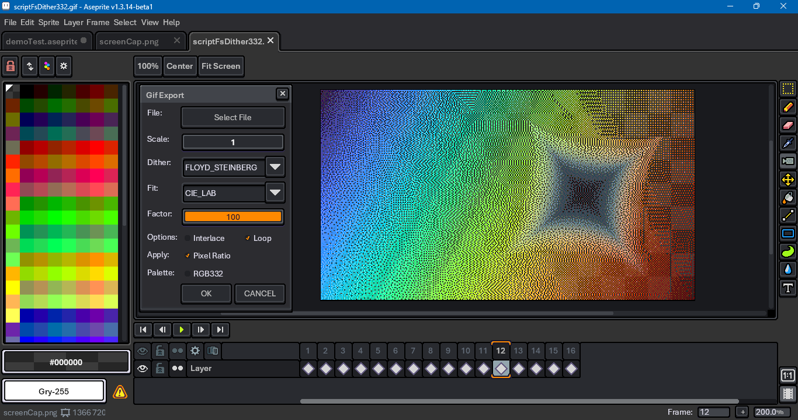

# Aseprite Gif Tool

This is an export tool that tries to mitigate issues with gif exports in [Aseprite](https://www.aseprite.org/). It is written in Lua using the Aseprite [scripting API](https://github.com/aseprite/api).

**I recommend trying [Gifski](https://gif.ski/) before you try this tool.** This is for cases when you have frames with nonuniform duration, or when exporting png sequences is an inconvenient middle step. There are also other online gif converter tools you can find through a search engine.

This script does not work around the 256 colors per all frames limit. Gifs can hold 256 colors per each frame, but since this script still uses Aseprite's gif encoder, it does not support that capability.

## Download

To download this script, click on the green Code button above, then select Download Zip. You can also click on the `gifExport.lua` file. Beware that some browsers will append a `.txt` file format extension to script files on download. Aseprite will not recognize the script until this is removed and the original `.lua` extension is used. There can also be issues with copying and pasting. Be sure to click on the Raw file button; do not copy the formatted code.

## Usage

To use this script, open Aseprite. In the menu bar, go to `File > Scripts > Open Scripts Folder`. Move the Lua script into the folder that opens. Return to Aseprite; go to `File > Scripts > Rescan Scripts Folder` (the default hotkey is `F5`). The script should now be listed under `File > Scripts`. Select `gifExport.lua` to launch the dialog.

If an error message in Aseprite's console appears, check if the script folder is on a file path that includes characters beyond ASCII, such as 'é' (e acute) or 'ö' (o umlaut).

A hot key can be assigned to the script by going to `Edit > Keyboard Shortcuts`. The search input box in the top left of the shortcuts dialog can be used to locate the script by its file name. Upon launching the dialog, the file select will have focus. Holding down the `Alt` key and pressing `O` will save the file. The dialog can be closed with `Alt+C`.

Below is a summary of what the script does:

- Duplicate the active sprite.
- Change the duplicate's color mode to RGB.
- Flatten the duplicate's layers.
- Remove any background layer.
- Either create a palette from the sprite or assign an RGB332 palette.
- Change the duplicate's color mode to indexed.
- Scale the sprite.
- Save a copy of the sprite to gif.
- Close the sprite.
- Reopen the sprite with `io.open`, change its header from 87 to 89.

For more on different gif headers, see [https://www.w3.org/Graphics/GIF/spec-gif89a.txt](https://www.w3.org/Graphics/GIF/spec-gif89a.txt).

Aseprite's implementation of [Bayer ordered dithering](https://en.wikipedia.org/wiki/Ordered_dithering) does not support alpha. However, it provides a more stable pattern for animations than [Floyd-Steinberg](https://en.wikipedia.org/wiki/Floyd%E2%80%93Steinberg_dithering) error diffusion dithering. The script provides an option to dither alpha separately.

## Comparison

To see the motivation behind this script, compare this animation, a webp,

with this gif output from Aseprite. (The original sprite was in RGB color mode.)

There is an issue with prior frames not being cleared and banding in the gradient.

Compare with the script result that uses Floyd-Steinberg dither

with Bayer dither, but no alpha,

and with alpha.

🇹🇼 🇺🇦